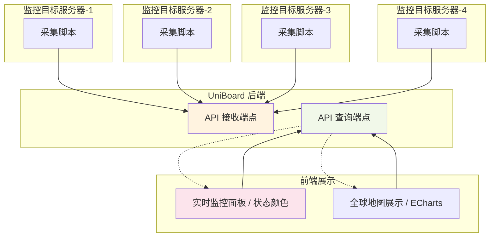

# 探针监控使用指南

UniBoard 内置了简单**克制**的探针服务，适用于希望快速了解各个节点存活状态的**轻量**用户。


## 设计理念

### 为什么是"推"模式？

UniBoard 采用被动的"推"方式收集监控数据，即探针主动向 UniBoard 上报数据，而非 UniBoard 主动拉取。这种设计有以下优势：

- **安全性**：UniBoard 永远不会向被监控目标主动**发送任何数据**，避免潜在的安全风险
- **网络友好**：被监控目标只需出站网络权限，无需开放入站端口，适合各种网络环境
- **简化部署**：避免复杂的网络配置和防火墙规则设置
- **降低资源消耗**：无需维护长连接，降低双端资源占用

### 数据流向



- 探针目标通过独立的 Key 进行身份认证
- 数据仅包含基础的系统指标（CPU、内存、负载）
- 5分钟无上报即视为离线，保持监控的时效性

## 快速开始

### 1. 创建探针目标

登录仪表盘 → 探针页面 → "新增探针目标"

配置信息：
- **名称**：易识别的名称
- **描述**：用途说明  
- **经纬度**：用于地图展示

### 2. 一键安装

#### 1. 前置准备

- Uniboard 需要已在系统设置中配置`站点URL`。
- Uniboard 需要以 **HTTPS** 方式部署

  **HTTPS** 并不是必选项，您可以在不启用 **HTTPS** 的情况下直接点击第二步。**不使用 HTTPS 会导致您的探针目标密钥对所有流量可见，任何中间人都可能伪造流量。**

  **Uniboard 的探针服务使用单向数据流。**理论上在上报数据过程中，**探针客户端永远不会接受来自服务器的任何数据**，使用 **HTTP** 对探针目标是安全的，不可能会让探针目标陷入安全风险。

  但是在探针目标上安装数据上报服务时，需要从您的 **Uniboard 实例获取数据上报脚本**，**此阶段若使用 HTTP 可能会使您的设备陷入中间人攻击，从而触发任意代码执行。**


:::info
Uniboard所提供的安装程序仅用于开箱即用的快速配置，您完全可以基于 OpenAPI 自行构建数据上报程序，API参阅 [API 文档](https://uniboard.apifox.cn/343396178e0)。
:::

#### 2. 生成安装脚本

1. 点击探针目标的下载按钮
2. 完成预检后点击继续
3. 确认要操作的目标探针
4. 点击生成按钮
5. **手动复制安装脚本到目标服务器执行**


```bash
# 类似于此
curl -fsSL "https://your-domain.com/api/probe-script/installer/probe/[ID]/key/[KEY]/interval/60" | sudo bash
```

:::info
您可以直接修改命令中`interval`后的数字来控制上报间隔，默认间隔为60秒。最终真实安装在探针目标上的脚本是实时生成的。
:::


脚本将自动配置系统服务并启动数据上报。

## 监控指标

- **CPU 使用率**：0-100%，绿色(≤60%) / 黄色(60-80%) / 红色(>80%)
- **内存使用率**：0-100%，同上颜色规则
- **系统负载**：绿色(≤1.0) / 黄色(1.0-2.0) / 红色(>2.0)
- **在线状态**：5分钟内有数据上报即为在线
- **实时刷新**：页面会实时轮询数据，展示探针目标的实时状态

## 地图展示

基于 ECharts 的全球地图，显示所有探针目标的地理位置和状态。探针以红色散点标识。

## 管理功能

- **Key 管理**：每个探针独立认证，支持一键刷新 Key
- **拖拽排序**：支持探针列表的拖拽排序，即刻生效
- **批量操作**：编辑、删除、安装脚本生成

## 下一步

- 了解 [短链服务](/guide/shorturl) 分享监控链接
- 参考 [API 文档](/api/) 进行二次开发
